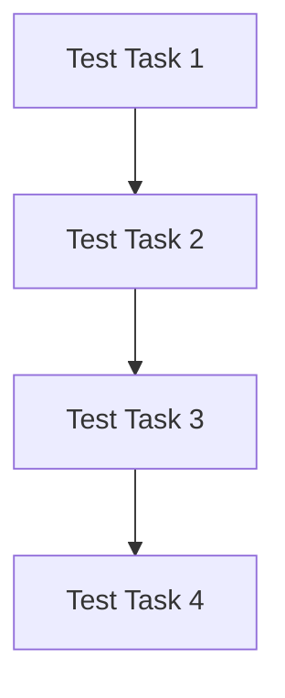

# Task Dependency Graph

## Dependency Graph Details

**Nodes (4):**
- Test Task 1 (bc7c7648-8746-43af-afc5-71cfc15c25cc) [completed]
- Test Task 2 (b8906d9b-a944-4e5f-8d7b-059835a722da) [completed]
- Test Task 3 (7175a0d0-6b1f-4219-88c6-465703cf7fbb) [completed]
- Test Task 4 (c15372a0-461f-4b0b-9b07-8e9003304a12) [completed]

**Edges (3):**
- bc7c7648-8746-43af-afc5-71cfc15c25cc → b8906d9b-a944-4e5f-8d7b-059835a722da (hard)
- b8906d9b-a944-4e5f-8d7b-059835a722da → 7175a0d0-6b1f-4219-88c6-465703cf7fbb (hard)
- 7175a0d0-6b1f-4219-88c6-465703cf7fbb → c15372a0-461f-4b0b-9b07-8e9003304a12 (hard)

## Critical Path

**Workflow ID:** a8350dfd-d2d6-44ee-bad8-bf2779f29047
**Path Length:** 4

**Critical Path:**
- Test Task 1 (bc7c7648-8746-43af-afc5-71cfc15c25cc)
- Test Task 2 (b8906d9b-a944-4e5f-8d7b-059835a722da)
- Test Task 3 (7175a0d0-6b1f-4219-88c6-465703cf7fbb)
- Test Task 4 (c15372a0-461f-4b0b-9b07-8e9003304a12)
